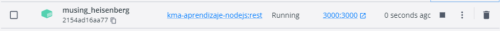

# Servicio REST CRUD

Este proyecto consiste en desarrollar un servicio REST para una entidad transaccional asignada al inicio del parcial. Además, se aplicará por lo menos una prueba unitaria para los métodos del servicio REST y se dockerizará tanto el servicio REST como sus pruebas.

## Desarrollo del servicio REST

Para el desarrollo del servicio REST se han utilizado las siguientes tecnologías:

Node.js: como entorno de ejecución de JavaScript.
Express: como framework para el desarrollo del servicio REST.
MongoDB: como base de datos para el almacenamiento de la información.
Mongoose: como ODM (Object Document Mapper) para la conexión y manejo de la base de datos MongoDB.
En este proyecto se han implementado los siguientes métodos del CRUD:

```
GET: Obtener todos los registros de la entidad.
GET/:id: Obtener un registro de la entidad por su ID.
POST: Crear un nuevo registro en la entidad.
PUT/:id: Actualizar un registro de la entidad por su ID.
DELETE/:id: Eliminar un registro de la entidad por su ID.
```

## Pruebas unitarias

Se han implementado pruebas unitarias utilizando el framework de pruebas Jest. Estas pruebas cubren los métodos del servicio REST y se han ejecutado con éxito.


## Dockerización

Se ha utilizado Docker para la dockerización del servicio REST y sus pruebas. Se han creado dos tags en la imagen:



#### latest: contiene la imagen del servicio REST.

#### test: contiene la imagen con las pruebas unitarias del servicio REST.

## Multistage

Se ha aplicado multistage a la imagen del servicio REST para separar la construcción de la imagen y la ejecución de la misma en tres etapas:

Etapa 1: Instalación de dependencias.
Etapa 2: Ejecución de las pruebas unitarias.
Etapa 3: Ejecución del servicio REST.

## Uso de la imagen

La imagen de Docker se encuentra disponible en Docker Hub con los siguientes nombres:


```
velezdavid/aaaas:latest: contiene la imagen del servicio REST.
velezdavid/aaaas:test: contiene la imagen con las pruebas unitarias del servicio REST.
```

Para ejecutar la imagen se puede utilizar el siguiente comando:

```
docker run -p 3000:3000 velezdavid/aaaas:latest
```


